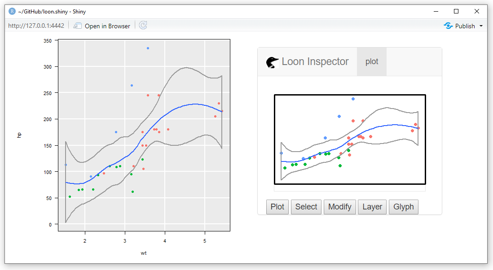

loon.shiny 

[](https://travis-ci.org/z267xu/loon.shiny)
[](https://cran.r-project.org/package=loon.shiny)
[](https://codecov.io/gh/z267xu/loon.shiny?branch=master)

## Display loon widgets in shiny app


[`Shiny`](https://shiny.rstudio.com/) provides interactive web applications in R. `JavaScript`, `CSS` and `Html` are wrapped in `r` functions. Users with zero experience on such areas can also build **fantastic**, **responsive** and **powerful** web pages. A `shiny` application is composed of two components, a `ui` (user interface) object and a `server` function. This UI/server pair are passed as arguments to the `shinyApp` function that creates a `shiny` app object.

[`Loon`](https://cran.r-project.org/web/packages/loon/vignettes/introduction.html) is an uncurated interactive toolkit engaged in an open-ended, creative and unscripted data exploration. Designed for interactive exploratory data analysis, `Loon` provides **true direct manipulations**. It can be horizontally/vertically panned, horizontally/vertically zoomed, and have plot elements linked to one another to effect such coordinated display behaviour as the selection of points, brushing, etc.

   In interactive data analysis, one of the major difficulties is to reproduce and present analysis procedure. Package `loon.shiny` transforms `loon` widgets into `shiny` web apps. The benefit is that the presentation of `loon` is not necessary to be fixed. The `loon` widgets can be rendered to an html file by `Rmarkdown` so that analysts who explore data in `loon` now can present their interactive graphics in `Rmarkdown` which can help other users to explore some other possibilities even to draw different conclusions. 

Online documentation [here](http://great-northern-diver.github.io/loon.shiny/)

## Installation

   ```r
   # From CRAN
   install.packages("loon.shiny")
   # Or from github
   devtools::install_github("great-northern-diver/loon.shiny")
   # Or as part of the diveR suite of loon related packages
   install.packages("diveR")
   ```

## 1. Basic `shiny` app

```r
library(loon.shiny)
p <- with(mtcars, l_plot(hp, mpg, color = cyl, size = wt))
shiny.loon(p)
```
produces a web based shiny app of a loon plot with a loon inspector:


## 2. Several linked plots in a `shiny` app

This is the more typical case. Here we show three plots
appearing as the output of knitting an RMarkdown file.


The code for the three plot shiny app on its own would be
(as shown above):

```r
p1 <- l_plot(iris, linkingGroup = "iris",
             showLabels = FALSE)
p2 <- l_hist(iris$Sepal.Length, linkingGroup = "iris",
             showLabels = FALSE, showStackedColors = TRUE)
p3 <- l_hist(iris$Sepal.Length, linkingGroup = "iris",
             showLabels = FALSE, swapAxes = TRUE,
             showStackedColors = TRUE)
shiny.loon(list(p1, p2, p3),
           layout_matrix = matrix(c(2, NA, 1, 3), nrow = 2, byrow = TRUE),
           plot_width = "400px")
```    


## 3. Start with ggplot --> loon --> shiny

Some users may prefer to begin with a `ggplot` and construct their plots
using the **grammar of interactive graphics** provided by 
[loon.ggplot](https://great-northern-diver.github.io/loon.ggplot/).
A simple example follows:

```r
library(loon.ggplot)
g <- ggplot(mtcars, mapping = aes(x = wt, y = hp)) + 
       geom_point(mapping = aes(color = factor(gear))) + 
       geom_smooth()

shiny.loon(loon.ggplot(g),
           left = 20,
           right = "auto")
```

which results in
    

   

Compared to `ggplot` to `shiny`, `ggplot` --> `loon` --> `shiny` extends the app to give more interactivity to the user. Users can now direct manipulate plots, such as highlighting points, changing colours and sizes, modifying layer orders, and more.

With several plots, linking allows brushing across several plots.


### To report issues

[https://github.com/great-northern-diver/loon.shiny/issues](https://github.com/great-northern-diver/loon.shiny/issues)

