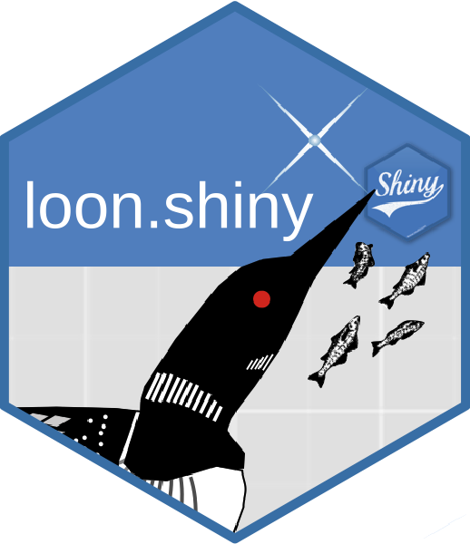

# loon.shiny 

[](https://travis-ci.org/great-northern-diver/loon.shiny)
[](https://cran.r-project.org/package=loon.shiny)


## Display loon widgets in shiny app

The [`shiny`](https://shiny.rstudio.com/) `R` package simplifies the creation of interactive analysis web pages. 
`Shiny` apps facilitate sharing data analyses while simultaneously allowing, even encouraging, some interactive 
exploration by the viewer.  An example would be the shiny app
that allows viewers to explore interesting features of
U.S. Secretary of State Clinton's emails at [https://shiny.math.uwaterloo.ca/sas/clinton/](https://shiny.math.uwaterloo.ca/sas/clinton/).
Such *curated* interaction is immensely important for both sharing analytic results and encouraging exploration. 

In contrast, the [`loon`](https://great-northern-diver.github.io/loon/) `R` package provides an interactive visualization toolkit for unconstrained, unscripted, and open-ended data exploration.
It is intended for data analysts themselves.  

The  [`loon.shiny`](http://great-northern-diver.github.io/loon.shiny/) `R` package enables `loon` plots and `loon` style interaction (e.g., brushing, linked plots, panning, zooming, etc., as well as a `shiny` version of `loon` inspectors) to be incorporated into a `shiny` application (including an `RMarkdown` file).  The `loon` widgets are rendered into an html file by `Rmarkdown` so that analysts who explore data in `loon` now can present their interactive graphics in `Rmarkdown`.
Other users can then explore the data online using the rich set of visual interactions available in `loon` as provided by the
creator of the curated analysis.

A single function, `shiny.loon()`, does the work.

-----

## 1. Basic `shiny` app

```r
library(loon.shiny)
p <- with(mtcars, l_plot(hp, mpg, color = cyl, size = wt))
shiny.loon(p)
```
produces a web based shiny app containing the `loon` plot `p`  together with its `loon` inspector:


## 2. Several linked plots in a `shiny` app

Here we show three plots
appearing as the output of knitting an `RMarkdown` file.
This is the more typical case. 


The code for the three plot shiny app on its own would be
(as shown above):

```r
p1 <- l_plot(iris, linkingGroup = "iris",
             showLabels = FALSE)
p2 <- l_hist(iris$Sepal.Length, linkingGroup = "iris",
             showLabels = FALSE, showStackedColors = TRUE)
p3 <- l_hist(iris$Sepal.Length, linkingGroup = "iris",
             showLabels = FALSE, swapAxes = TRUE,
             showStackedColors = TRUE)
shiny.loon(list(p1, p2, p3),
           layout_matrix = matrix(c(2, NA, 1, 3), nrow = 2, byrow = TRUE),
           plot_width = "400px")
```    

Note that the plots are linked and the inspector is shared by/addresses all three plots (see tabs on the inspector).

## 3. Start with ggplot --> loon --> shiny

Some users may prefer to begin with a `ggplot` and construct their plots
using the **grammar of interactive graphics** provided by 
[loon.ggplot](https://great-northern-diver.github.io/loon.ggplot/).
A simple example follows:

```r
library(loon.ggplot)
g <- ggplot(mtcars, mapping = aes(x = wt, y = hp)) + 
       geom_point(mapping = aes(color = factor(gear))) + 
       geom_smooth()

shiny.loon(loon.ggplot(g),
           left = 20,
           right = "auto")
```

which results in
    

   

Compared to `ggplot` to `shiny`, `ggplot` --> `loon` --> `shiny` extends the app to give more interactivity to the user. Users can now direct manipulate plots, such as highlighting points, changing colours and sizes, modifying layer orders, and more.

With several plots, linking allows brushing across several plots.

-----

## Installation

   ```r
   # From CRAN
   install.packages("loon.shiny")
   # Or from github
   devtools::install_github("great-northern-diver/loon.shiny")
   # Or as part of the diveR suite of loon related packages
   install.packages("diveR")
   ```
   
## Rmarkdown

An R Markdown file containing Shiny widgets and outputs is an interactive document. To make an R Markdown document interactive in two steps:

- add `runtime: shiny` to the document's YAML header. For example, 

   ```r
   ---
   title: "My Title"
   author: "You"
   date: "15/05/2021"
   output: html_document
   runtime: shiny
   ---
   ```

- add Shiny widgets and Shiny render functions to the file's R code chunks. Note that, in a single R markdown file, more than one apps can be added. 
   
### To report issues

[https://github.com/great-northern-diver/loon.shiny/issues](https://github.com/great-northern-diver/loon.shiny/issues)

-----

## The `diveR` suite

`loon`, `loon.shiny`, and `loon.ggplot` are all part of the `diver` suite of packages ([https://great-northern-diver.github.io/diveR/](https://great-northern-diver.github.io/diveR/)), the `looniverse` for **d**irect **i**nteractive **v**isual **e**xploration in **`R`**.
